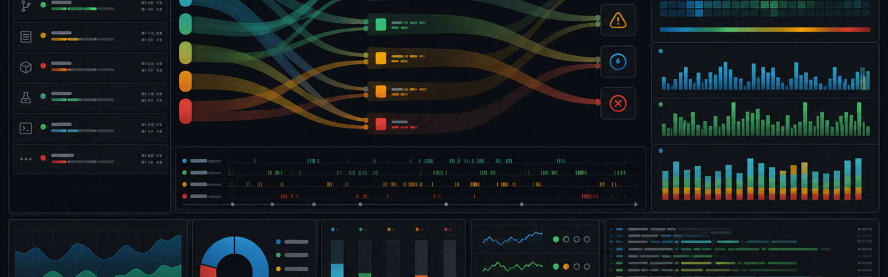
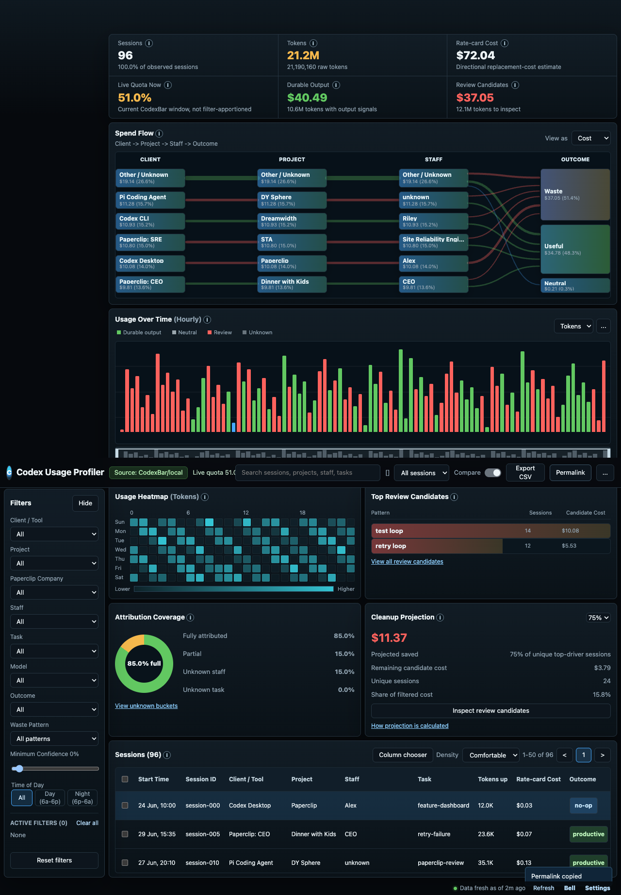
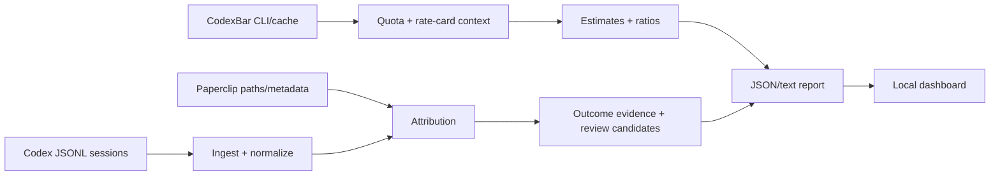

# Codex Usage Profiler



Find where your agentic coding budget actually went.

Codex Usage Profiler is a local, read-only investigation tool for Codex session logs. It turns local JSONL sessions and optional CodexBar telemetry into a compact dashboard and reports grouped by tool, project, task, staff, time, model, tokens, directional rate-card cost, and review-candidate patterns.

It is designed to answer:

- Which apps and harnesses are using the most tokens?
- Which projects, tasks, and sessions deserve inspection?
- When did usage happen?
- Which repeated patterns may be wasting quota?
- Where is attribution too weak to trust?

It is not an official billing, quota, or productivity system. Cost values are directional rate-card replacement-cost estimates. Current quota windows come from CodexBar when available, but historical local sessions are not automatically converted into true subscription quota consumption. Outcome labels are evidence buckets, not judgments.

## Two-Minute Demo

```bash
git clone https://github.com/saphid/codex-usage-profiler.git
cd codex-usage-profiler
python3 -m pip install -e .
npm install

codex-usage-dashboard --report samples/demo-report.json
```

Open the printed local URL, usually [http://127.0.0.1:8765/](http://127.0.0.1:8765/).

You should see a dark dashboard with:

- Summary cards for sessions, tokens, rate-card cost, live quota, durable-output signals, and review candidates.
- A Sankey/alluvial flow from client to project to staff to outcome.
- Hourly timeline, day/hour heatmap, ranked comparisons, attribution coverage, and cleanup projection.
- A sortable session table and evidence drawer.



## Profile Your Local Logs

Default scan:

```bash
codex-usage-profiler
```

Common reports:

```bash
codex-usage-profiler --days 7 --top 20
codex-usage-profiler --since 2026-06-24
codex-usage-profiler --format json --output reports/latest.json
codex-usage-dashboard --report reports/latest.json
```

Use explicit paths when you want a bounded scan:

```bash
codex-usage-profiler --no-codexbar --paths ~/.codex/sessions
```

Raw prompt and response bodies are not printed by default. Use `--include-snippets` only when you explicitly want bounded redacted task snippets in JSON/text output.

## What The Tool Produces

- Usage grouped by client, project, task, model, day, hour, Paperclip company, Paperclip staff, and Paperclip task.
- Top sessions by observed tokens and rate-card cost.
- Current CodexBar quota windows when CodexBar is installed.
- CodexBar local-vs-cache ratio rows to reveal scope mismatch.
- Review candidates such as repeated command signatures, no-op automation, repeated queries, startup-heavy sessions, and test loops.
- A local dashboard for filtering, charting, exporting, and inspecting evidence.

## How To Read The Numbers

- `Tokens`: observed tokens found in local session logs.
- `Rate-card cost`: directional replacement-cost estimate from known model rates or CodexBar pricing caches.
- `Live quota now`: current CodexBar quota window, not a historical usage allocation.
- `Observed share`: share of tokens within the scanned local logs.
- `Durable output`: sessions with observable output signals such as edits, tests, commits, PRs, or action tools. This does not prove end-user value.
- `Review candidates`: sessions matching patterns worth inspecting. These can overlap with durable-output sessions.
- `Confidence`: weakest key attribution signal across client, project, staff, and task.

## CodexBar

The profiler intentionally leans on Peter Steinberger's [CodexBar](https://github.com/steipete/codexbar) when available instead of reimplementing its auth and provider logic.

Supported local inputs:

- `codexbar usage --provider codex --source auto --format json`
- `codexbar cost --provider codex --format json`
- `~/Library/Application Support/com.steipete.codexbar/history/codex.json`
- `~/Library/Caches/CodexBar/cost-usage/codex-v*.json`
- `~/Library/Caches/CodexBar/cost-usage/pi-sessions-v*.json`
- `~/Library/Caches/CodexBar/model-pricing/models-dev-v*.json`

CodexBar is MIT licensed. This project uses its public CLI/cache outputs and gives attribution here.

## OpenSpec Story

This project was built with OpenSpec as an explicit design trail:

- `openspec/changes/build-usage-profiler/`: ingestion, attribution, quota/cost estimates, outcome evidence, reporting.
- `openspec/changes/add-session-dashboard-ui/`: compact dashboard, user stories, mockup validation, interaction contract.
- `docs/dashboard-final-interaction-contract.md`: card-by-card interaction expectations.
- `docs/critical-review.md`: subagent critique summary and which critical fixes were accepted.

## Architecture



## Tests

```bash
PYTHONPATH=src python3 -m unittest discover -q
npm test
openspec validate add-session-dashboard-ui --strict
```

The E2E dashboard test launches a local server with synthetic data, drives the browser through filters/charts/drawer/export, and saves a screenshot under `reports/`.

## Limitations

- Local logs may be incomplete or duplicated across harnesses.
- Cost is a directional replacement-cost estimate, not an invoice.
- Live quota is current-window telemetry, not historical allocation.
- CodexBar ratio rows can show scope mismatch, not just missing data.
- Paperclip staff usually means agent role; task labels are strongest when explicit issue/task IDs are present.
- Review candidates are prompts for inspection; repeated command signatures are not proof of failed retry loops.

## License

MIT. See [LICENSE](LICENSE).
